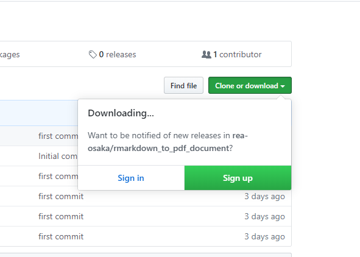

--- 
title: "GitHubリポジトリをダウンロードする"
author: "Syunsuke Fukuda"
date: "`r Sys.Date()`"
documentclass: bxjsbook
site: bookdown::bookdown_site
classoption: xelatex,ja=standard
---

```{r setup, include=FALSE}
knitr::opts_chunk$set(echo = TRUE, cache = TRUE, fig.align = "center")

# 出力フォーマットが TeX（PDF含む）の場合のみ対処する
if (knitr::opts_knit$get("rmarkdown.pandoc.to") %in% c("beamer", "latex")) {

  # conversion failure on '...' in 'mbcsToSbcs' の Warning 発生の workaround
  options(device = function(file, width = 7, height = 7, ...) {
    cairo_pdf(tempfile(), width = width, height = height, ...)
  })
  
  ## 1. cairo_pdf を使う方法
  # * family には OS にインストールされているフォント名を指定する。
  knitr::opts_chunk$set(dev="cairo_pdf", dev.args=list(family="Meiryo"))
}
```

データ委員会では、いくつものツールをGitHub上で公開しています。
そこで、ここでは、このGitHub上のツールをどうやって利用するのかを紹介します。

# 事前に

データ委員会では、Rのツールを使うための初心者向けドキュメントを公開しています。
GitHubからツールをダウンロードする前に、Rのインストールや、
Rの基本的な使い方に関する以下の二つのドキュメントもご覧ください。

- [初心者向けRのインストールガイド](https://syunsuke.github.io/r_install_guide_for_beginners/) 
- [Rビギナーズガイド](https://syunsuke.github.io/r_beginners_guide/)

# GitHubの構造とリポジトリ

GitHubには、まず、ユーザーや組織毎に与えられる**アカウント**というものがあります。
そして、そのアカウントが行っている開発が保存されている個々の場所を**リポジトリ**（リポジトリとは**倉庫**という意味の英語です。）と呼んでいます。
GitHubの各アカウントのページを開くと、そのアカウントが持っているリポジトリの一覧を見ることが出来ます。
ここで、rea-osakaのGitHubページを見てみましょう。
GitHubのページを見るために、**GitHubのアカウントを持っている必要はありません**ので、特に何の準備も必要ありません。

https://github.com/rea-osaka/


図\@ref(fig:repo001)は、実際のrea-osakaのGitHubのページです。

```{r repo001, echo=FALSE, out.width="95%", fig.cap="GitHubのページ"}
knitr::include_graphics("images/repo001.png")
```

そこにみられる`making_improved_koujiDB`や、`address_db`などが、リポジトリです。


ここで、GitHub内でのリポジトリを表す記述の仕方は一般に、
「誰それ（アカウント）がやっている/何々というプロジェクト（リポジトリ）」という風にかかれ、
リポジトリが一意に決定される表現が用いられています。
そこで、例えば、rea-osakaアカウントのretiというリポジトリは以下のように表現されます。

```
rea-osaka/reti
```

この表記は、巷のWebページでのリポジトリの紹介でもみられますし、
アプリの設定ファイル内でもつかわれます。
Rにおいても、パッケージのインストールで引数に渡す文字列もそうです。

```{r eval=FALSE}
# retiパッケージのインストール
devtools::install_github("rea-osaka/reti")
```

また、この表記の前に`https://github.com/`
を付けることでそのリポジトリのページのURLになることを覚えておくと役に立つかもしれません。


# リポジトリ

`rea-osaka/rmarkdown_to_pdf_document`というリポジトリのページを見てみましょう。

https://github.com/rea-osaka/rmarkdown_to_pdf_document


図\@ref(fig:pdfdocpage001)は、実際の`rea-osaka/rmarkdown_to_pdf_document`のページです。

ページ上部にリポジトリ名が記され、その下にタブが並んでいます。
デフォルトでは**code**が選択されており、
ページ内には、そのリポジトリに保存されているファイルの一覧が表示されています。

```{r pdfdocpage001, echo=FALSE, out.width="95%", fig.cap="リポジトリのページ"}

```

ここで、GitHubでは、このファイル一覧、すなわち、
リポジトリの内容を簡単に丸ごとダウンロードすることが出来るようになっています。

ファイル一覧の右上にある緑のボタン（図\@ref(fig:clone001)）に注目してください。
ボタンには「clone or download」と書かれています。
このボタンをクリックしてください。

```{r clone001, echo=FALSE, out.width="60%", fig.cap="緑のボタン"}
knitr::include_graphics("images/clone001.png")
```

クリックすると、図\@ref(fig:clone002)のように、2択を迫られます。

```{r clone002, echo=FALSE, out.width="60%", fig.cap="２択"}
knitr::include_graphics("images/clone002.png")
```

右側の「Download Zip」を選択します。

選択した直後に、図\@ref(fig:clone003)の用に表示されることがあります。
これは、リポジトリ更新のお知らせを設定するためのサインインを促すダイアログですが、
初めは気にすることはありません。
ダイアログ以外のところをクリックすると消えます。
サインインする必要も、GitHubにアカウントを作成する必要もありません。


```{r clone003, echo=FALSE, out.width="60%", fig.cap="設定のためのサインインを促すダイアログ"}

```


# リポジトリとRStudioのプロジェクト

rea-osakaで公開しているリポジトリのうち、
Rに関連したものの多くは、
RStudioのプロジェクトとして利用できるようになっています。

ダウンロードして展開したフォルダの中に
拡張子が「.Rproj」となっているファイルがあるなら、
そのリポジトリはRStudioのプロジェクトとなっています。

RStudioのプロジェクトであると、
拡張子が「.Rproj」であるプロジェクトファイルをダブルクリックするだけで、
RStudioが立ち上がり、
そのフォルダをカレントディレクトリに設定した
コンソールが使えるようになります。

ですから、プロジェクト内のスクリプトが適切な相対パスで記述されている限り、
リポジトリ内にある別ディレクトリのデータなども適切に読み込んで
実行させることが出来ます。

すなわち、プロジェクトとしてリポジトリを管理しておけば、
リポジトリをダウンロードするだけで、作成した人と同じ相対パス環境が担保され、
RStudioを開いて、そのままスクリプトを実行するだけで、
作成者と同じスクリプトの実行結果を簡単に得ることが出来ます。


# あとがき

以上のやり方だけ覚えておけば、
GitHubに公開されているリポジトリを自分のパソコンにダウンロードし、
そのリポジトリの中のプログラムをRStudioで実行したり、
レポートを編集したりすることが出来るようになります。

つまりは、GitHubのページにあるダウンロードボタンを押して
zipファイルをダウンロードするだけです。

しかし、もし、更にGitHubについて興味があるならば、
以下を読み進めて見てください。

## ダウンロードとクローン

GitHubに興味がある人だったり、Gitというバージョン管理システムを聞いたことがある人にとっては、
GitHubというと、なにか複雑で専門的なものだと感じる人が多いと思います。
しかし、リポジトリをダウンロードすること自体は、
バージョン管理とは何の関係もなく、リポジトリ単位のディレクトリを
圧縮したものを単純にダウンロードするだけです。
ですから、ダウンロードしたフォルダの中には、gitによる履歴情報もありません。
GitHubのことをよく知らない人であっても大丈夫です、
何か知らないものが入っていることもないですし、
勝手にわけの変わらないことがおこることもありません。

一方で、開発に携わっている人はダウンロードではなくて、
クローンという方法でリポジトリを自分のパソコンにコピーします。

通常、プログラミング等の開発は、
少しづつプログラムのコードが書き加えられて進んでいきますが、
その際に、この進んでいく過程を一定の区切りごとにその状態を記録して、
保存しておく事ができるバージョン管理システムというツールが活用されます。
このバージョン管理システムには有名なものがいくつもありますが、
そのひとつが、**Git**です。

GitHubのリポジトリにあるプログラムはすべて、**Git**によるバージョン管理のもとにあります。
開発者が、そのリポジトリの開発にかかわる時には、
そのGitにって管理された履歴全体を自分のパソコンにコピーする必要があるので、
単なる今の状態をダウンロードするのではなく、
リポジトリを**クローン**することが必要になります。

### GitHub Desktopというアプリ

さて、これは、余談ですが、
巷のGitHub情報をみれば、クローン等を行う場合、シェルのコンソール等から
呪文のようなgitコマンドを駆使する方法が紹介されています。
Macの場合、デフォルトでUnix系の環境下にあり、
普通のシェルが動いているのでgitコマンドも使いやすいのですが、
Windowsの場合、gitコマンドをコンソールから発行すること自体の準備が必要だったり、
初心者にとっては少し敷居が高い状態にあります。
しかし、実は、Windowsでクローンするのにコンソールにコマンドを打つ必要は全くありません。

先ほど、リポジトリのページの「緑のボタン」を押した時に出てくる
ダイアログを思い出してください。（図\@ref(fig:clone002)）
２択のもう一方には「Open in Desktop」とかかれていました。
実は、この選択肢は、「デスクトップに開く」という意味ではありません。
**「GitHub Desktop」というアプリで開く**という意味です。
GitHub Desktopは、GitHub純正のリポジトリ管理アプリであり、
GitHubのリポジトリ管理をGUIで簡単にしたアプリです。

間違って、クリックした人も大丈夫です。
GitHub Desktopがインストールされていない場合は、インストールが促され、
そのアプリが開いて、クローンしてくれます。
デフォルトのクローン先はドキュメントフォルダの中の
`GitHub`というディレクトリ以下にクローンされます。

GitHub Desktopをインストールすれば、
Gitのツールも一緒にインストールされるので、
別途何かをインストール必要もありません。
この後に紹介している各種Gitの操作も、
GitHub Desktop上でできます。

ですから、もし、実際に自分でGitやGitHubを活用しようとするならば
GitHub Desktopの利用をお勧めします。

https://desktop.github.com/

```{r githubdesktop001, echo=FALSE, out.width="95%", fig.cap="GitHub Desktopのページ"}

```


## GitHubとGit

GitHubでは何が行われているか、Gitとはなんなのか、もう少し話を続けてみます。
GitやGitHubの参考書や解説記事を読む時の前提知識として参考にしてみてください。

### クローンとプッシュ

上記で、開発者はダウンロードではなく、クローンをするとお話ししました。
開発者のパソコンにクローンされた、
リポジトリは、プログラムを改良するためにその中身が書き換えられて行きます。
最終的に完成した改良版のプログラムは、
また、GitHubのリポジトリで公開されることになりますが、
クローンとは逆に、
自分のパソコンから、GitHubへリポジトリの内容がアップロードされることになります。
このアップロードを**プッシュ**といいます。

### ローカルとリモート

クローンとプッシュについては、
「**ローカル**」と「**リモート**」という単語が一緒によく出てきます。
「ローカル」は、自分のパソコンのことです。
「リモート」は、主にGitHubのことです。
「リモートからローカルにクローンする」という風に使われます。
クローンされたプログラムは、ローカルで書き換えられ、
改良が完成したらGitHub上のリポジトリにアップロードして、その変更を反映します。
そういう時に、「ローカルからリモートへプッシュする」と言います。

### コミット

クローンとプッシュは、ローカルとリモート間のやり取りの話です。
ここからは、主にローカルでの開発作業の途中でのgitのキーワードについてみてみましょう。

クローンしたプログラムを書き換えていく際に、
gitでデータをセーブすることを「**コミット**」といいます。
gitでのセーブは、
セーブデータの上書きではなく、
その都度のセーブデータが、ずっと保存されて行きます。
ですから、開発を始めた時点から、
今までにコミットしたすべての時点の状態を再現することが出来ます。
簡単に言えば、gitは、バックアップとリストアの機能を行うためのアプリなのです。

コミットにつきもののキーワードとして「**ステージング**」があります。
gitは、高機能なバックアップシステムなので、
コミットする範囲を柔軟に選択できるのです。

gitで経過の記録をとることが「写真を撮る」に例えられることがあります。
写真館で写真を撮る時のように、
写真を撮るときには舞台（ステージ）に載るという風にイメージして見てください。
登場人物は、各ファイルです。
そして、gitでのコミットは、ステージ上にのっている登場人物だけを記録します。
ですから、gitでは、コミットの前に必ず、
何をコミットするかの指定をする作業がつきものになります。

gitを使い始めた時には、
何のためにステージングするのか分からないことが多く、
いちいちステージングするのがめんどくさく感じるものですが、
このコミットの対象範囲を限定する機能を上手に使うことで、
意味のあるまとまりごとのコミットを作って管理することが出来るようになります。


### ブランチ

続いて、「**ブランチ**」というキーワードもgitの作業で必ず目にことになります。
リポジトリは、一見、ファイルが入っている普通のディレクトリのように見えますが、
実は、いくつもの**並列世界**を持つことが出来ます。
そして、このそれぞれの並列世界のことをブランチといいます。
同じフォルダの中に、コピーが重複して存在しているイメージです。

通常、一番初めにリポジトリを作った時は、ブランチは一つで、
「master（マスター）」というブランチ名がついています。
他の新しいブランチは、自分の好きな別のブランチをコピーすることによって作成されます。
そして、この新しいブランチは、いつでも、好きなだけ作ることが出来ます。

ブランチは、切り替えて使います。
ブランチを切り替えることを「**チェックアウト**」といいます。
「チェックアウト」の語感が「切り替える」と異なるため、誤解しそうですが、
「ブランチをチェックアウトする」というのは、
テレビのチャンネルをガチャガチャ切り替えるのと同じイメージです。

ブランチは、ブランチ毎に内容が独立しているので、
異なる作業をすれば、同じディレクトリ内に、
異なる内容のブランチが同時に並列に存在することになります。
そして、ブランチを切り替えると一瞬でディレクトリ内容が切り替わります。

一般にプログラムを改良していく場合に、ブランチ機能が利用されます。
もともとある、プログラムをいきなり書き換えるのではなく、
一旦、コピーし（新しいブランチを作って切り替え）、
そこで、プログラムの変更を行っていきます。
この場合、もともとのプログラムは、別に残っているので、
いつでもブランチを切り替えれば、元のプログラムも使うことが出来ます。
更には、いくらでも、ブランチが作成できるので、
同時進行で、別の試みをいくらでも試すことも可能です。


### マージ

各ブランチの始まりは、どこかのブランチからのコピーで始まります。
そして、各ブランチはいらなくなって削除されて終わりを迎えたり、
他のブランチと合体することで片方がなくなって終わりを迎えたりします。

ブランチそのものは、あるディレクトリ内に並列世界ができるだけなので、
作成されたブランチはそれぞれ我が道を行くこともできるわけですが、
開発者は、ある秩序立てたルールのもとに、
これらの機能を利用することが通常です。

そのルールは、
「master」という名前のブランチを正当なものとして、
他のブランチでプログラムを編集し、それが完成したとき、
そのブランチの内容を反映させるために「master」ブランチに合体させるというものです。
そして、このブランチを合体させることを「**マージ**」と呼びます。

### GitHubとプルリクエスト

ここまで、ローカルでのgitの主な機能について、
コミット、ブランチ、マージというキーワードの形で紹介してみました。
gitというツールが何をするものかについて、少しイメージが掴めたでしょうか。

では、一方で Git と似たような名前を持つ GitHub とは、何なのでしょうか？
GitHubが開発においてどのように活用されているかを紹介してみます。

まずは、GitHubは、gitで管理しているリポジトリをWeb上（リモート）で公開しているものです。
ですから、クローンのところでお話しした通り、
リモートのリポジトリをクローンすることで、
ローカルに今までの開発過程を丸ごと再現することが出来ます。
そして、
ローカルにクローンされたリポジトリは、
自分の好きなようにいくらでもプログラムの改造ができます。

ここで、クローンしたプログラムを改良して、
めちゃめちゃ素晴らしいプログラムが完成したとします。
そうしたら、
このローカルで完成したプログラムをリモートにプッシュすることで、
新たに完成した更に素晴らしいプログラムを、また、GitHubで世界に公開することが出来ます。

しかしここで、常識的に考えて、
誰でもがプッシュできるとすると、
何の検証もされていないプログラムが紛れ込んだり、
悪意でいたずらするものがいたとしたら、いたずらもし放題になってしまいます。
ですから、GitHubでは、当然、アカウントごとにプッシュできる権限が制限されていて、
権限を持っている人以外はリモートリポジトリの書き換えができないようになっています。

そこで、GitHubのシステムで最も重要なキーワード「プルリクエスト」が登場します。

前述で、リポジトリをコピーすることを「クローン」と言っていました。
しかし、実は、GitHubのコピーにはもう一つの種類があります。
「クローン」は、ローカルにコピーすることを言います。
一方で、もう一つのコピーとは、
自分がGitHub上にアカウントを持っている場合、
他のアカウントのリポジトリを自分のアカウントにコピーすることをいい、
これを「**フォーク**」と呼んでいます。

他人のリポジトリを自分のアカウントにコピーするなんて、
何かいけないことをしているように思うかもしれませんが、
これが公開されているプログラムの改変を行っていくときの通常の流れになります。
そして、フォークすることで、自分のアカウントのリポジトリになっているのですから、
それをローカルにクローンして改変作業を行った結果を、
遠慮なくプッシュして、改変を公開することが出来ます。
つまり、自分のアカウント上のフォークしてきたリポジトリの内容は、
フォーク元のアカウントのリポジトリよりも、より良い状態の亜種が出来たことになります。

ここで、本流であるフォーク元のアカウントの人に、問いかけることが出来ます。

**「こんな風に改良してみましたけど、採用してみませんか？」**

これを、GitHubでは「**プルリクエスト**」と呼んでいます。

本流のリポジトリを管理している管理者は、
その提案を受け入れて、その変更をリポジトリに「**プル**」することが出来ます。
もちろん、受け入れるか、入れないかは、管理者が自由に選択できます。


GitHub上のオープンソースの開発においては、
勝手に亜種を作るというよりも、
もとのリポジトリ上のISSUEという問題定義の場所において、
話題になっている不具合であったり、機能改善の提案であったりを
出来る人が手分けして、改善していくイメージです。
そして、改善にかかわっていくことは「貢献（コントリビュート）」と呼ばれ、
沢山改善にかかわっている人達はやがてコントリビューターとして、認識されるようになります。
はじめて貢献する場合等には、フォークしてプルリクエストしていますが、
そのうち、コントリビューターとして認識されるようになると、
開発用のブランチを本流のリポジトリにプッシュする権限をもらったりして、
マスターブランチとの間でマージするようになったりもします。


### 個人的な使い方

さて、GitHubやGitは、単なるツールであって、
こういう風に**使わなければならない**というものではありません。
ツールでできることを把握したうえで、**こう使えば便利だ**というふうに使われいるにすぎません。

先にも話した通り、GitやGitHubは一般的に、
チームによる開発をスムーズにするためのプラットホームなんていう
小難しいイメージを持つことも多いですが、
個人で使うならば、
一般的な共有ストレージである dropbox や google drive のように使うと便利です。
また、プログラミングはちょこちょこと書いていると、
直ぐにどこかに埋もれて無くなってしまいます。
しかし、GitHubに入れておけば、ずーっと昔に書いたものでも、懐かしく（恥ずかしく）見直すことが出来ます。


